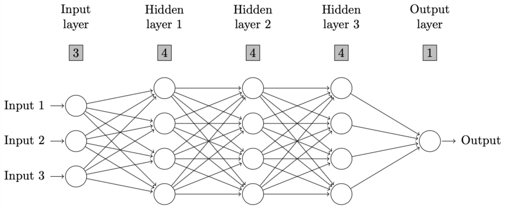
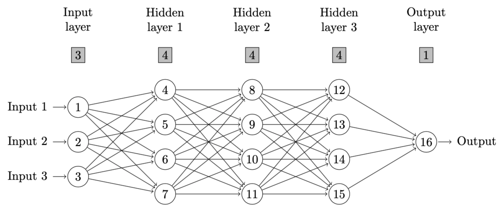
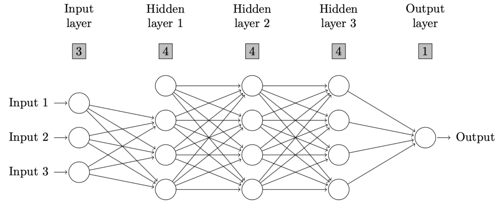
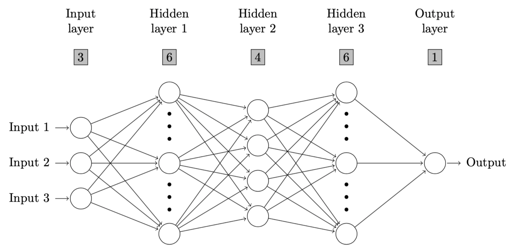
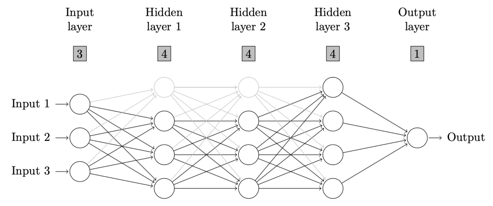
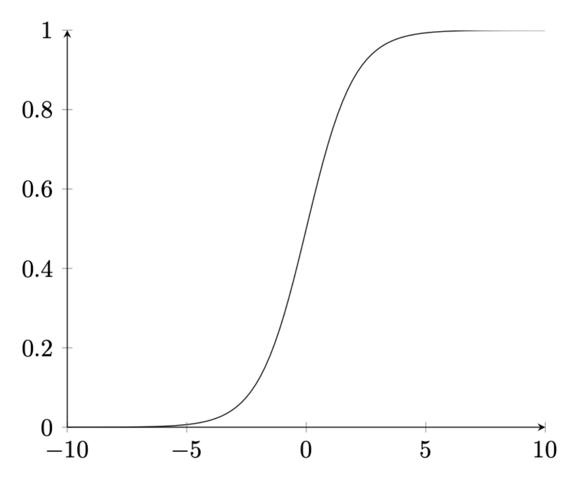

# nndiagram 

[](https://makeapullrequest.com)


> Generates 'LaTeX' code for drawing well-formatted neural network diagrams with [TikZ](https://www.overleaf.com/learn/latex/TikZ_package). Users have to define number of neurons on each layer, and optionally define neuron connections they would like to keep or omit, layers they consider to be oversized and neurons they would like to draw with lighter color. They can also specify the title of diagram, color, opacity of figure, labels of layers, input and output neurons. In addition, this package helps to produce 'LaTeX' code for drawing activation functions which are crucial in neural network analysis. To make the code work in a 'LaTeX' editor, users need to install and import some 'TeX' packages including [TikZ](https://www.overleaf.com/learn/latex/TikZ_package) in the setting of 'TeX' file.

## Installation

You can install the development version of nndiagram from [GitHub](https://github.com/) with:
      
``` r
# install.packages("devtools")
devtools::install_github("ccfang2/nndiagram")
```

## Example 1

```r
# A neural network diagram with 3 neurons on input layer, 4 neurons on each of 3 hidden layers, 
# and 1 neuron on output layer. No connection is omitted and all other arguments are default.
nndiagram(input=3, hidden=c(4,4,4))
```
The output is given as follows.

```latex
% To make the code work in any LaTeX editor, users need to install and import two TeX packages in the setting, including TikZ.
% Users are recommended to try the output LaTeX code in Overleaf.
 
\usepackage{tikz} 
\usepackage{ifthen} 
\def\layersep{2.5cm} 
\newcommand*\circled[1]{\tikz[baseline=(char.base)]{ 
  \node[shape=rectangle,inner sep=3pt, draw=black!100, fill= black!25] (char) {#1};}} 
 
\begin{figure}[!ht] 
\centering 
\begin{tikzpicture}[shorten >=1pt,->,draw=black!100, node distance=\layersep, scale=1] 
  \tikzstyle{every pin edge}=[<-,shorten <=1pt]; 
  \tikzstyle{neuron}=[circle, draw=black!100, minimum size=17pt,inner sep=0pt]; 
  \tikzstyle{input neuron}=[neuron]; 
  \tikzstyle{output neuron}=[neuron]; 
  \tikzstyle{hidden neuron}=[neuron]; 
  \tikzstyle{annot} = [text width=4em, text centered, text=black!100] 
 
  % drawing neurons 
  \foreach \name / \y in {1,...,3} 
      \node [input neuron, pin=left:\textcolor{black!100}{Input \y}] (I-\name) at (0,-0.5-\y) {};
  \foreach \name / \y in {1/1,2/2,3/3,4/4} 
      \path[yshift=0cm] 
          node[hidden neuron] (H-\name) at (1* \layersep,-\y cm) {};
  \foreach \name / \y in {5/1,6/2,7/3,8/4} 
      \path[yshift=0cm] 
          node[hidden neuron] (H-\name) at (2* \layersep,-\y cm) {};
  \foreach \name / \y in {9/1,10/2,11/3,12/4} 
      \path[yshift=0cm] 
          node[hidden neuron] (H-\name) at (3* \layersep,-\y cm) {};
  \node[output neuron,pin={[pin edge={->}]right:\textcolor{black!100}{Output}}, right of=H-10, yshift=-0.5cm] (O) {}; 

   % drawing arrows 
  \foreach \source in {1,...,3} 
      \foreach \dest in {1,...,4}
           \path (I-\source) edge (H-\dest); 
  \foreach \source in {1,...,4} 
      \foreach \dest in {5,...,8}
           \path (H-\source) edge (H-\dest); 
  \foreach \source in {5,...,8} 
      \foreach \dest in {9,...,12}
           \path (H-\source) edge (H-\dest); 
  \foreach \source in {9,...,12}
           \path (H-\source) edge (O);
 
   % annotations 
  \node[annot,above of=I-1, node distance=2.5cm] {Input layer}; 
  \node[annot,above of=I-1, node distance=1.5cm] {$\circled{3}$}; 
  \node[annot,above of=H-1, node distance=2cm] (hl1) {Hidden layer 1}; 
  \node[annot,above of=H-1, node distance=1cm] (hl1) {$\circled{4}$}; 
  \node[annot,above of=H-5, node distance=2cm] (hl2) {Hidden layer 2}; 
  \node[annot,above of=H-5, node distance=1cm] (hl2) {$\circled{4}$}; 
  \node[annot,above of=H-9, node distance=2cm] (hl3) {Hidden layer 3}; 
  \node[annot,above of=H-9, node distance=1cm] (hl3) {$\circled{4}$}; 
  \node[annot,above of =O, node distance=3.5cm] {Output layer}; 
  \node[annot,above of =O, node distance=2.5cm] {$\circled{1}$}; 

\end{tikzpicture} 
\caption{} 
\label{} 
\end{figure} 
```

Users can copy and paste the output above to a LaTeX editor, such as [Overleaf](https://www.overleaf.com) to draw the neural network diagram as defined. Please be aware that two TeX packages, i.e., [TikZ](https://www.overleaf.com/learn/latex/TikZ_package) and [ifthen](https://www.ctan.org/pkg/ifthen#:~:text=Ifthen%20is%20a%20separate%20package%20within%20the%20LaT.,always%20needed%20to%20load%20it.%20Sources.%20%2Fmacros%2Flatex%2Fbase.%20Documentation.) need to be installed and imported in the setting of TeX file as instructed in the comment of output above. The resulting diagram in this example is as follows.



If a user assigns the output to a variable, then he or she can still print out the LaTeX code by following syntax.

```r
nnd <- nndiagram(input=3, hidden=c(4,4,4))
cat(paste(nnd,"\n"))
```

## Example 2

If a user hopes to delete certain neuron connections or only keep certain connections, he or she could simply define the arguments `omit` or `keep` in `nndiagram`. For example, `omit="->4"` means that the connection from neuron 1 to 4 is omitted. In package `nndiagram`, neurons are counted from top to bottom and from left to right, as shown in figure below.



So, the code to produce such a neural network with omitted connections is as follows.

```r
nndiagram(input=3, hidden=c(4,4,4), omit=c("->4"))
```

The output and resulting diagram are as follows.

```latex
% To make the code work in any LaTeX editor, users need to install and import two TeX packages in the setting, including TikZ.
% Users are recommended to try the output LaTeX code in Overleaf.
 
\usepackage{tikz} 
\usepackage{ifthen} 
\def\layersep{2.5cm} 
\newcommand*\circled[1]{\tikz[baseline=(char.base)]{ 
  \node[shape=rectangle,inner sep=3pt, draw=black!100, fill= black!25] (char) {#1};}} 
 
\begin{figure}[!ht] 
\centering 
\begin{tikzpicture}[shorten >=1pt,->,draw=black!100, node distance=\layersep, scale=1] 
  \tikzstyle{every pin edge}=[<-,shorten <=1pt]; 
  \tikzstyle{neuron}=[circle, draw=black!100, minimum size=17pt,inner sep=0pt]; 
  \tikzstyle{input neuron}=[neuron]; 
  \tikzstyle{output neuron}=[neuron]; 
  \tikzstyle{hidden neuron}=[neuron]; 
  \tikzstyle{annot} = [text width=4em, text centered, text=black!100] 
 
  % drawing neurons 
  \foreach \name / \y in {1,...,3} 
      \node [input neuron, pin=left:\textcolor{black!100}{Input \y}] (I-\name) at (0,-0.5-\y) {};
  \foreach \name / \y in {1/1,2/2,3/3,4/4} 
      \path[yshift=0cm] 
          node[hidden neuron] (H-\name) at (1* \layersep,-\y cm) {};
  \foreach \name / \y in {5/1,6/2,7/3,8/4} 
      \path[yshift=0cm] 
          node[hidden neuron] (H-\name) at (2* \layersep,-\y cm) {};
  \foreach \name / \y in {9/1,10/2,11/3,12/4} 
      \path[yshift=0cm] 
          node[hidden neuron] (H-\name) at (3* \layersep,-\y cm) {};
  \node[output neuron,pin={[pin edge={->}]right:\textcolor{black!100}{Output}}, right of=H-10, yshift=-0.5cm] (O) {}; 

   % drawing arrows 
  \foreach \source in {1,...,3} 
      \foreach \dest in {1,...,4}
         \ifthenelse{\source=3 \AND \dest=1}{}{
         \ifthenelse{\source=2 \AND \dest=1}{}{
         \ifthenelse{\source=1 \AND \dest=1}{}{
           \path (I-\source) edge (H-\dest)}}}; 
  \foreach \source in {1,...,4} 
      \foreach \dest in {5,...,8}
           \path (H-\source) edge (H-\dest); 
  \foreach \source in {5,...,8} 
      \foreach \dest in {9,...,12}
           \path (H-\source) edge (H-\dest); 
  \foreach \source in {9,...,12}
           \path (H-\source) edge (O);
 
   % annotations 
  \node[annot,above of=I-1, node distance=2.5cm] {Input layer}; 
  \node[annot,above of=I-1, node distance=1.5cm] {$\circled{3}$}; 
  \node[annot,above of=H-1, node distance=2cm] (hl1) {Hidden layer 1}; 
  \node[annot,above of=H-1, node distance=1cm] (hl1) {$\circled{4}$}; 
  \node[annot,above of=H-5, node distance=2cm] (hl2) {Hidden layer 2}; 
  \node[annot,above of=H-5, node distance=1cm] (hl2) {$\circled{4}$}; 
  \node[annot,above of=H-9, node distance=2cm] (hl3) {Hidden layer 3}; 
  \node[annot,above of=H-9, node distance=1cm] (hl3) {$\circled{4}$}; 
  \node[annot,above of =O, node distance=3.5cm] {Output layer}; 
  \node[annot,above of =O, node distance=2.5cm] {$\circled{1}$}; 

\end{tikzpicture} 
\caption{} 
\label{} 
\end{figure} 
```



## Latest release

<details><summary>Version 1.0.0 </summary>
<p>

There are three new functions in this version as contrast to the previous version

* Neural Network Diagrams with Over-sized Layers
      
In some large scale neural networks, users may hope to draw the diagram in a more concise way with some neurons left out and use suspension points instead. `nndiagram_oversize` suffices their demand. Users only need to define the cutoff number of neurons. For example, in a neural network with 3 neurons on input layer, and 6, 4, 6 neurons on three hidden layers respectively, if a user define 5 is the cutoff value, then the first and third hidden layers are considered to be oversized and will be drawn in a more concise fashion. Following is an example.
      
```r
nndiagram_oversize(input=3, hidden=c(6,4,6), size.cutoff=5)
```

The output and resulting diagram are as follows.
      
```latex
% To make the code work in any LaTeX editor, users need to install and import two TeX packages in the setting, including TikZ.
% Users are recommended to try the output LaTeX code in Overleaf.
 
\usepackage{tikz} 
\def\layersep{2.5cm} 
\newcommand*\circled[1]{\tikz[baseline=(char.base)]{ 
  \node[shape=rectangle,inner sep=3pt, draw=black!100, fill= black!25] (char) {#1};}} 
 
\begin{figure}[!ht] 
\centering 
\begin{tikzpicture}[shorten >=1pt,draw=black!100, node distance=\layersep, scale=1] 
  \tikzstyle{every pin edge}=[<-,shorten <=1pt]; 
  \tikzstyle{neuron}=[circle, draw=black!100, minimum size=17pt,inner sep=0pt]; 
  \tikzstyle{invisible neuron}=[draw=none, scale=2]; 
  \tikzstyle{input neuron}=[neuron]; 
  \tikzstyle{output neuron}=[neuron]; 
  \tikzstyle{hidden neuron}=[neuron]; 
  \tikzstyle{annot} = [text width=4em, text centered, text=black!100] 
 
  % drawing neurons 
  \foreach \name / \y in {1,...,3} 
      \node [input neuron, pin=left:\textcolor{black!100}{Input \y}] (I-\name) at (0,-1-\y) {};
  \node[hidden neuron,yshift=0cm] (H-1) at (1* \layersep, -1 cm) {}; 
  \node[invisible neuron,yshift=0cm] (H-2) at (1* \layersep, -2 cm) {}; 
  \node[hidden neuron,yshift=0cm] (H-3) at (1* \layersep, -3 cm) {}; 
  \node[invisible neuron,yshift=0cm] (H-4) at (1* \layersep, -4 cm) {}; 
  \node[hidden neuron,yshift=0cm] (H-5) at (1* \layersep, -5 cm) {};
  \foreach \name / \y in {6/1,7/2,8/3,9/4} 
      \path[yshift=-0.5cm] 
          node[hidden neuron] (H-\name) at (2* \layersep,-\y cm) {};
  \node[hidden neuron,yshift=0cm] (H-10) at (3* \layersep, -1 cm) {}; 
  \node[invisible neuron,yshift=0cm] (H-11) at (3* \layersep, -2 cm) {}; 
  \node[hidden neuron,yshift=0cm] (H-12) at (3* \layersep, -3 cm) {}; 
  \node[invisible neuron,yshift=0cm] (H-13) at (3* \layersep, -4 cm) {}; 
  \node[hidden neuron,yshift=0cm] (H-14) at (3* \layersep, -5 cm) {};
  \node[output neuron,pin={[pin edge={->}]right:\textcolor{black!100}{Output}}, right of=H-12, yshift=0cm] (O) {}; 
  \draw[line width=3pt, loosely dotted, dash pattern=on 0.1pt off 10pt, line cap=round] ([yshift=1ex]H-2.north) -- ([yshift=-1ex]H-2.south); 
  \draw[line width=3pt, loosely dotted, dash pattern=on 0.1pt off 10pt, line cap=round] ([yshift=1ex]H-4.north) -- ([yshift=-1ex]H-4.south); 
  \draw[line width=3pt, loosely dotted, dash pattern=on 0.1pt off 10pt, line cap=round] ([yshift=1ex]H-11.north) -- ([yshift=-1ex]H-11.south); 
  \draw[line width=3pt, loosely dotted, dash pattern=on 0.1pt off 10pt, line cap=round] ([yshift=1ex]H-13.north) -- ([yshift=-1ex]H-13.south); 

   % drawing arrows 
  \foreach \source in {1,...,3} 
      \foreach \dest in {1,3,5} 
          \path [->] (I-\source) edge (H-\dest);
  \foreach \source in {1,3,5} 
      \foreach \dest in {6,...,9} 
          \path [->] (H-\source) edge (H-\dest);
  \foreach \source in {6,...,9} 
      \foreach \dest in {10,12,14} 
          \path [->] (H-\source) edge (H-\dest);
  \foreach \source in {10,12,14} 
      \path [->] (H-\source) edge (O); 
 
  % annotations 
  \node[annot,above of=I-1, node distance=3cm] {Input layer}; 
  \node[annot,above of=I-1, node distance=2cm] {$\circled{3}$}; 
  \node[annot,above of=H-1, node distance=2cm] (hl1) {Hidden layer 1}; 
  \node[annot,above of=H-1, node distance=1cm] (hl1) {$\circled{6}$}; 
  \node[annot,above of=H-6, node distance=2.5cm] (hl2) {Hidden layer 2}; 
  \node[annot,above of=H-6, node distance=1.5cm] (hl2) {$\circled{4}$}; 
  \node[annot,above of=H-10, node distance=2cm] (hl3) {Hidden layer 3}; 
  \node[annot,above of=H-10, node distance=1cm] (hl3) {$\circled{6}$}; 
  \node[annot,above of =O, node distance=4cm] {Output layer}; 
  \node[annot,above of =O, node distance=3cm] {$\circled{1}$}; 

\end{tikzpicture} 
\caption{} 
\label{} 
\end{figure} 
```


      
* Neural Network Diagrams with Some Neurons being Covered up

In neural network analysis, users may hope to deemphasize some neurons and draw them with lighter color. In package `nndiagram`, they can do that simply by using command `nndiagram_nodeCoverup`. Users are expected to define the argument `node.coverup` properly. For example, in a neural network with 3 neurons on input layer, and 4 neurons on each of the three hidden layers, if a user hopes to deemphasize the first neuron on both the first and second hidden layer, then he needs to define `node.coverup=c(4,8)`. The rule of neuron indexing is the same as that in command `nndiagram`.

```r
nndiagram_nodeCoverup(input=3, hidden=c(4,4,4), node.coverup = c(4,8))   
```

The output and resulting diagram are as follows.
      
```latex
% To make the code work in any LaTeX editor, users need to install and import two TeX packages in the setting, including TikZ.
% Users are recommended to try the output LaTeX code in Overleaf.
 
\usepackage{tikz} 
\def\layersep{2.5cm} 
\newcommand*\circled[1]{\tikz[baseline=(char.base)]{ 
  \node[shape=rectangle,inner sep=3pt, draw=black!100, fill= black!25] (char) {#1};}} 
 
\begin{figure}[!ht] 
\centering 
\begin{tikzpicture}[shorten >=1pt,draw=black!100, node distance=\layersep, scale=1] 
  \tikzstyle{every pin edge}=[<-,shorten <=1pt, draw=black!100]; 
  \tikzstyle{neuron}=[circle, draw=black!100, minimum size=17pt,inner sep=0pt]; 
  \tikzstyle{input neuron}=[neuron]; 
  \tikzstyle{output neuron}=[neuron]; 
  \tikzstyle{hidden neuron}=[neuron]; 
  \tikzstyle{coveruped neuron}=[neuron, draw=black!25]; 
  \tikzstyle{annot} = [text width=4em, text centered, text=black!100] 
 
  % drawing neurons 
  \foreach \name / \y in {1/1,2/2,3/3} 
      \node[input neuron, pin=left:\textcolor{black!100}{Input \y}] (I-\name) at (0,-0.5-\y) {}; 
  \foreach \name / \y in {2/2,3/3,4/4} 
      \path[yshift=0cm] 
          node[hidden neuron] (H-\name) at (1* \layersep,-\y cm) {}; 
  \foreach \name / \y in {6/2,7/3,8/4} 
      \path[yshift=0cm] 
          node[hidden neuron] (H-\name) at (2* \layersep,-\y cm) {}; 
  \foreach \name / \y in {9/1,10/2,11/3,12/4} 
      \path[yshift=0cm] 
          node[hidden neuron] (H-\name) at (3* \layersep,-\y cm) {}; 
  \foreach \name / \y in {1/1} 
      \path[yshift=0cm] 
          node[coveruped neuron] (H-\name) at (1* \layersep,-\y cm) {}; 
  \foreach \name / \y in {5/1} 
      \path[yshift=0cm] 
          node[coveruped neuron] (H-\name) at (2* \layersep,-\y cm) {}; 
  \node[output neuron,pin={[pin edge={->}]right:\textcolor{black!100}{Output}}, right of=H-10, yshift=-0.5cm] (O) {}; 
 
  % drawing arrows 
  \foreach \source in {1,2,3} 
      \foreach \dest in {2,3,4} 
          \path [->] (I-\source) edge (H-\dest); 
  \foreach \source in {1,...,3} 
      \foreach \dest in {1} 
          \path [->] (I-\source) edge [draw=black!25] (H-\dest); 
  \foreach \source in {2,3,4} 
      \foreach \dest in {6,7,8} 
          \path [->] (H-\source) edge (H-\dest); 
  \foreach \source in {6,7,8} 
      \foreach \dest in {9,10,11,12} 
          \path [->] (H-\source) edge (H-\dest); 
  \foreach \source in {1} 
      \foreach \dest in {5,...,8} 
          \path [->] (H-\source) edge [draw=black!25] (H-\dest); 
  \foreach \source in {1,...,4} 
      \foreach \dest in {5} 
          \path [->] (H-\source) edge [draw=black!25] (H-\dest); 
  \foreach \source in {5} 
      \foreach \dest in {9,...,12} 
          \path [->] (H-\source) edge [draw=black!25] (H-\dest); 
  \foreach \source in {9,10,11,12} 
      \path [->] (H-\source) edge (O); 

   % annotations 
  \node[annot,above of=I-1, node distance=2.5cm] {Input layer}; 
  \node[annot,above of=I-1, node distance=1.5cm] {$\circled{3}$}; 
  \node[annot,above of=H-1, node distance=2cm] (hl1) {Hidden layer 1}; 
  \node[annot,above of=H-1, node distance=1cm] (hl1) {$\circled{4}$}; 
  \node[annot,above of=H-5, node distance=2cm] (hl2) {Hidden layer 2}; 
  \node[annot,above of=H-5, node distance=1cm] (hl2) {$\circled{4}$}; 
  \node[annot,above of=H-9, node distance=2cm] (hl3) {Hidden layer 3}; 
  \node[annot,above of=H-9, node distance=1cm] (hl3) {$\circled{4}$}; 
  \node[annot,above of =O, node distance=3.5cm] {Output layer}; 
  \node[annot,above of =O, node distance=2.5cm] {$\circled{1}$}; 

\end{tikzpicture} 
\caption{} 
\label{} 
\end{figure}       
```

      

* Activation Function 

Activation functions are crucial in neural network analysis. Hence, in this version, command `activation_curve` is also added to help with the drawing of activation function in LaTeX. Users can either choose from ReLU, sigmoid and step functions, the three most popular activation functions, or define the expression on their own in argument `expr`. Following is an example of sigmoid function.

```r
activation_curve(expr="sigmoid", title="Sigmoid Function", xmin=-5, xmax=5)
```      

The output and resulting figure are as follows.
      
```latex
% To make the code work in any LaTeX editor, users need to install and import two TeX packages in the setting, including TikZ.
% Users are recommended to try the output LaTeX code in Overleaf.

\usepackage{tikz} 
\usepackage{pgfplots} 
\pgfplotsset{compat=1.18} 
\begin{figure}[!ht] 
\centering 
\begin{tikzpicture}[scale=1] 
  \begin{axis}[ 
      axis on top = true, 
      axis x line = bottom, 
      axis y line = left, 
      xlabel = $$, 
      ylabel = $$, 
      ymin = , 
      ymax =  
  ] 
  \addplot[ 
      domain=-5:5, 
      samples=100 
  ] {1/(1+exp(-x))}; 
  \end{axis} 
\end{tikzpicture} 
\caption{Sigmoid Function} 
\label{} 
\end{figure}       
```      

    
      
</p>
</details>

## Note
- This package is an ongoing project, and more functions will be added in the future, such as those to produce pdf version of diagrams or convert handdrawing neural network diagrams to computerized ones. 
- Collaborations are sincerely welcome. Comments and suggestions are always highly appreciated.

## Contact

Chencheng Fang, Email: [ccfang[at]uni-bonn.de](mailto:ccfang@uni-bonn.de),
Bonn Graduate School of Economics, University of Bonn, Germany
